# ADR 0003: MCP Server AWS Lambda Deployment Architecture

## Status
Accepted

## Context
The Model Context Protocol (MCP) server needs to be deployed as a scalable, secure, and cost-effective solution for providing CSV analysis tools to Cursor IDE users. The server must handle both local file analysis and AWS S3 CSV processing while maintaining security, performance, and operational simplicity.

Key requirements:
- **Scalability**: Handle multiple concurrent users without performance degradation
- **Security**: Secure API endpoints with proper authentication and authorization
- **Cost-effectiveness**: Pay-per-use model with minimal idle costs
- **Maintainability**: Easy deployment, updates, and monitoring
- **Integration**: Seamless integration with MCP-compatible clients (Cursor IDE, Claude, etc.)

## Decision

### Deployment Architecture
- **Compute**: AWS Lambda (serverless) for automatic scaling and cost optimization
- **API Gateway**: RESTful API with IAM authentication for secure access
- **Storage**: AWS S3 for CSV file storage with least-privilege access
- **Deployment**: GitHub Actions for CI/CD with automated testing

### Architecture Diagram

```mermaid
graph TB
    User[👤 User] --> MCPClient[🔧 MCP Client<br/>Cursor IDE / Claude]
    MCPClient --> |"HTTPS + IAM Auth"| APIGateway[🌐 API Gateway<br/>REST API]
    APIGateway --> |"Invoke"| Lambda[⚡ AWS Lambda<br/>MCP Server]
    
    Lambda --> S3[🗄️ AWS S3<br/>CSV Files]
    Lambda --> Delta[📊 Databricks<br/>Delta Tables]
    Lambda --> Local[📁 Local Files<br/>/data directory]
    
    subgraph "AWS Cloud"
        APIGateway
        Lambda
        S3
    end
    
    subgraph "External Services"
        Delta
    end
    
    subgraph "Client Environment"
        User
        MCPClient
        Local
    end
    
    classDef aws fill:#ff9900,stroke:#232f3e,stroke-width:2px,color:#fff
    classDef external fill:#0066cc,stroke:#003d82,stroke-width:2px,color:#fff
    classDef client fill:#28a745,stroke:#1e7e34,stroke-width:2px,color:#fff
    
    class APIGateway,Lambda,S3 aws
    class Delta external
    class User,MCPClient,Local client
```



### Security Model
- **API Authentication**: AWS IAM for both MCP and health endpoints
- **S3 Access**: Least-privilege IAM policy for specific bucket only
- **Network Security**: API Gateway with IAM authorization (no public access)
- **Data Protection**: No persistent storage of sensitive data

### Tool Architecture
- **Local Tools**: `csv_tools.py` for local file analysis
- **S3 Tools**: `s3_csv_tools.py` for cloud CSV processing
- **Auto-registration**: `tools/__init__.py` for automatic tool discovery
- **Modular Design**: Easy addition of new tools without code changes

### Performance Optimizations
- **Cold Start**: Module-level imports and connection pooling
- **Memory**: 1024MB allocation for pandas operations
- **Timeout**: 120 seconds for large file processing
- **Connection Reuse**: Boto3 client with keep-alive and retry configuration

## Consequences

### Positive
- **Cost Efficiency**: Pay only for actual usage with no idle costs
- **Automatic Scaling**: Handles traffic spikes without manual intervention
- **Security**: IAM-based authentication with least-privilege access
- **Maintainability**: Single deployment package with automated CI/CD
- **Performance**: Optimized for cold starts and data processing
- **Flexibility**: Easy to add new tools and modify existing ones

### Negative
- **Cold Start Latency**: Initial request may have 2-4 second delay
- **Memory Limits**: 10GB maximum memory for Lambda (may limit very large files)
- **Timeout Constraints**: 15-minute maximum execution time
- **Vendor Lock-in**: Tightly coupled to AWS services
- **Debugging Complexity**: Serverless debugging can be more challenging

### Risks & Mitigations
- **Risk**: Cold start performance impact
  - **Mitigation**: Optimized imports, connection pooling, and 1024MB memory allocation
- **Risk**: Large file processing timeouts
  - **Mitigation**: Chunked processing and 120-second timeout configuration
- **Risk**: S3 access security breaches
  - **Mitigation**: Least-privilege IAM policy for specific bucket only
- **Risk**: API Gateway costs for high traffic
  - **Mitigation**: IAM authentication reduces unnecessary requests
- **Risk**: Lambda concurrency limits
  - **Mitigation**: AWS Lambda automatically scales up to account limits

### Operational Considerations
- **Monitoring**: CloudWatch logs for debugging and performance monitoring
- **Deployment**: GitHub Actions with automated testing and rollback capability
- **Updates**: Zero-downtime deployments with Lambda function versioning
- **Cleanup**: Automated resource cleanup via GitHub Actions workflow

## Implementation Details

### File Structure
```
├── lambda_handler.py          # AWS Lambda entry point
├── mcp_proxy.py              # MCP proxy for Cursor
├── server.py                 # MCP server configuration
├── tools/
│   ├── __init__.py           # Auto-registers all tools
│   ├── csv_tools.py          # Local CSV analysis tools
│   └── s3_csv_tools.py       # S3 CSV analysis tools
├── utils/
│   ├── file_reader.py        # Local file utilities
│   └── s3_csv_processor.py   # S3 CSV processing utilities
└── .github/workflows/
    ├── deploy.yml            # Deployment automation
    └── cleanup.yml           # Resource cleanup
```

### Security Configuration
- **API Gateway**: IAM authorization for all endpoints
- **Lambda Permissions**: Specific API Gateway invoke permissions
- **S3 Access**: `s3:GetObject` and `s3:ListBucket` for specific bucket only
- **IAM Policies**: Least-privilege access with resource-specific ARNs

### Performance Configuration
- **Memory**: 1024MB for pandas operations
- **Timeout**: 120 seconds for large file processing
- **Architecture**: x86_64 for optimal performance
- **Runtime**: Python 3.12 with optimized dependencies

## References
- [AWS Lambda Best Practices](https://docs.aws.amazon.com/lambda/latest/dg/best-practices.html)
- [API Gateway Security](https://docs.aws.amazon.com/apigateway/latest/developerguide/security.html)
- [MCP Protocol Specification](https://modelcontextprotocol.io/)
- [Cursor IDE Documentation](https://cursor.com/docs/context/mcp)

## Related ADRs
- None (first deployment architecture decision)

## Decision Date
2025-09-26